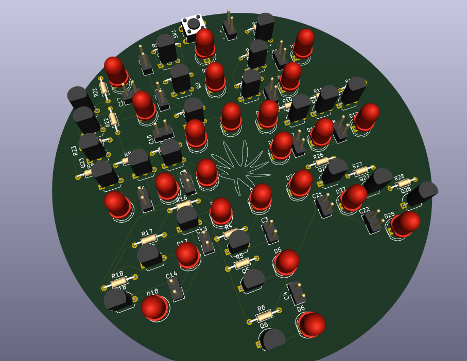
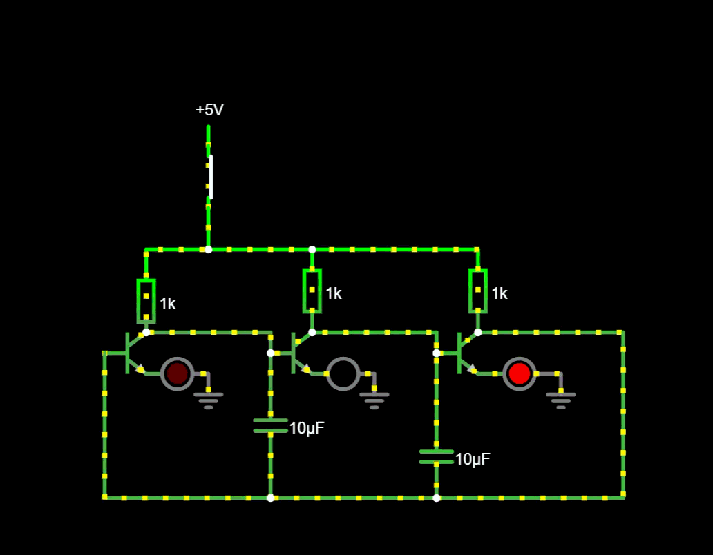
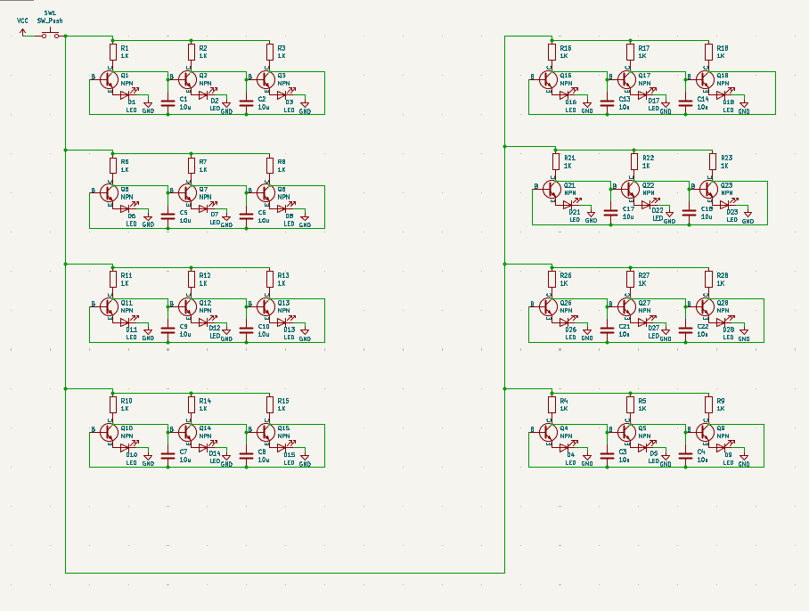
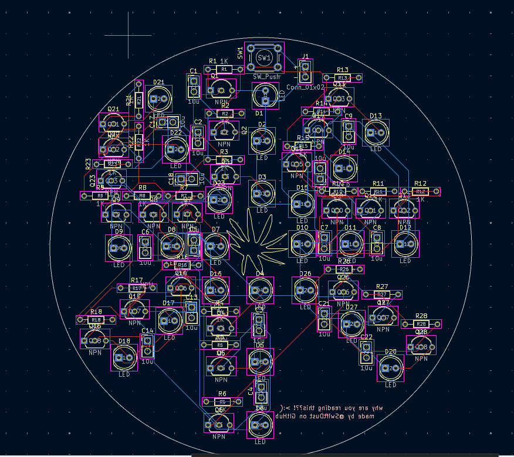

# Fireworks

This is a fireworks PCB. I made this because starting 2026, fireworks are forbidden on New Years Eve in The Netherlands. Fireworks are always a huge tradition for my family and for our people in general, and I made a little 'fake' firework simulation to make up for it.

## Simulation

The LEDs are all connected to a 5V power source, which routes through 1k capacitors to the LEDs. Between the LEDs and the capacitors are transistors, whose outputs are fed into each other. In between the LEDs are capacitors, which constantly charge and discharge due to the constant change in voltage. This creates a sequencing effect in each of the LED series. They are connected in groups of three.

[Link to schematic](https://is.gd/zdDuyj)

## Schematic

## PCB

---

Much thanks to Rudy (@Outdatedcandy82), for staying super patient and helping me wherever he could!
